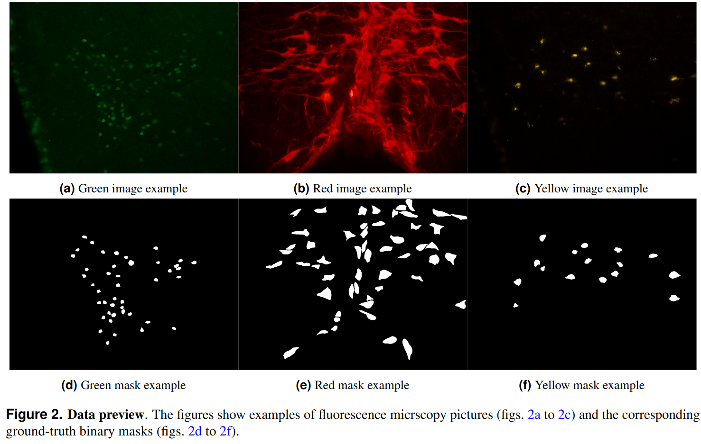
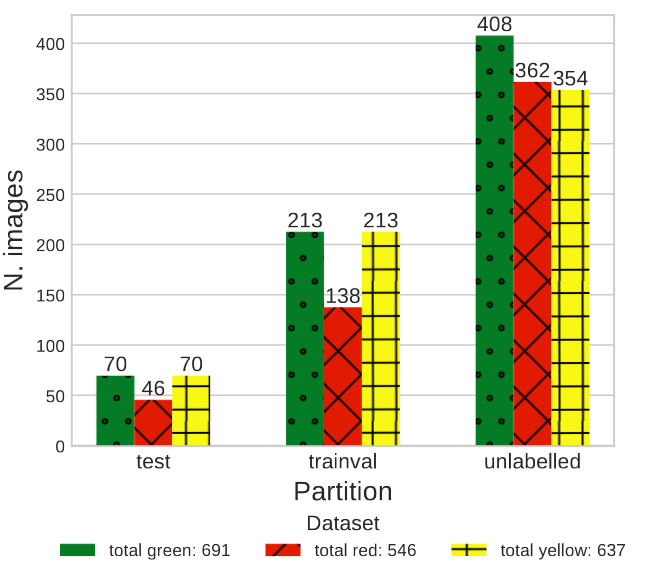

[](https://www.python.org/downloads/release/python-360/)
[](https://github.com/psf/black)
</a>
[](https://opensource.org/licenses/Apache-2.0)
[](https://visitorbadge.io/status?path=https%3A%2F%2Fgithub.com%2FTIO-IKIM%2FCellViT)

# Fluocells Neuronal Cells v2



This repository contains the code accompanying the submission to Scientific Data of the **Fluocells Neuronal Cells (FNC) v_2 archive**.
This is a collection of 1874 high-resolution images acquired with a fluorescence microscope. 
The pictures depict several neuronal and subnuclear structures, highlighted with various staining patterns.
Alongside the images, we also share 750 ground-truth labels in several popular annotation *types* (*segmentation masks, bounding boxes, dot-annotation, count*) and *formats* (*binary masks, COCO, Pascal VOC, VIA*). 



The dataset can be used as a benchmark for Computer Vision applications concerning many learning task, including **semantic segmentation, object detection, object counting, transfer learning, self-supervised learning**, and more.
For more details, please refer to <DOI TO INSERT>.

## Installation
In order to install you can clone this repository and simply follow the instructions contained in [`installation.txt`](installation.txt).

## Structure

```
fluocells-scientific-data/
├── dataOps: scripts for preliminary processing
├── dataset_v2: data folder (downloaded archive)
├── figures: paper figures and illustrations
├── fluocells: utils package for data processing, visualization, modelling and evaluation
├── models: folder with pre-trained weights
├── notebooks: example notebooks to perform data exploration, training pipeline setup and sample experiment
├── installation.txt: list of bash commands run to create paper environment
├── training.py: script to perform sample training
├── evaluate.py: script to evaluate model starting from pre-trained weights. This performs the association of true and predicted objects according to IoU overlapping and centers distance
└── compute_metrics.py: script to compute segmentation, detection and counting metrics for a list of experiments
```


## Usage

The repository contains the prototype **[fluocells](fluocells/) python package**, that collects main utils adopted to perform data manipolation, modelling and evaluation.

```
fluocells/
├── __init__.py
├── config.py: set all paths (data, metadata, models)
├── models: utils to implement and handle c-ResUnet with torch/fastai
│   ├── __init__.py
│   ├── _blocks.py
│   ├── _models.py
│   └── _utils.py
└── utils
    ├── __init__.py
    ├── annotations.py: utils to handle data annotations
    ├── data.py: utils to handle data processing
    └── metrics.py: utils to assess model performance
```

### Training
To run a sample training experiment simply run the script [`training.py`](training.py):

```
python training.py <dataset_name> [--seed N] [--gpu_id 0]
```
*seed* will be set randomly if not specified.

Note that this assumes the `DATA_PATH` variable in [`fluocells/config.py`](fluocells/config.py) is correctly set to the folder where FNC data are, with the following structure:

```
dataset_v2/<dataset_name>
├── test
│   ├── ground_truths
│   ├── images
│   └── metadata
├── trainval
│   ├── ground_truths
│   ├── images
│   └── metadata
└── unlabelled
    ├── images
    └── metadata

./ground_truths/
├── masks: png images with binary masks
├── rle: pickle files with Running Length Encoding (RLE) of binary masks
├── Pascal_VOC: *.xml* files with image annotations (polygon, bbox, dot)
├── COCO
    └── annotations_green_trainval.json
└── VIA
    └── annotations_green_trainval.json
```

### Evaluation
In order to evaluate pre-trained models you have to run first [`evaluate.py`](evaluate.py):

```
python evaluate exp_name [--bin_thresh 0.5] [--smooth_disk 0] [--max_hole 50] [--min_size 200] [--max_dist 30] [--fp 40] [--iou_thresh 0.5] [--prox_thresh 40] [--device cpu]
```

This script loads pre-trained weights in `models/<exp_name>/model.pth` and assess performance on the test set (dataset is retrieved by the experiment name). 
The prediction include also post-processing operations like: *contours smoothing, hole/small objects removal and waterhsed*. 

The association of true and predicted objects (namely, True Positives, False Positives and False Negatives) is computed based on both i) overlapping (IoU) and ii) proximity (centers distance).
The arguments `iou_thresh` and `prox_thresh` determine the cutoff for a positive match (TP) for i) and ii), respectively.
For more details, please refer to evaluate.py parser help.

The results are stored under the `logs/<exp_name>` folder.

After that, simply run the [`compute_metrics.py`](compute_metrics.py) script to compute *segmentation, detection* (F1 score, precision, recall) and *counting* (MAE, MedAE, MPE) metrics.

```
python compute_metrics.py exp_name1 [exp_name2 ...]
```

## Raw data and pre-processing

If you want to work on raw original data (*.TIFF* images and *.csv* polygon annotations in VIA format), or simply replicate initial data conversion, you will find all the relevant code under the `dataOps` folder (raw data can be found in the *raw_data.zip* archive available at the data repository):

- `convert_raw2png.py` takes files in `raw_data` folder and converts them to uncompressed *.png* images, also encoding all metadata
- `VIA_to_binary_mask.py` takes polygon annotations contained in *-csv* files compatible with VGG VIA and transform them into binary segmenation masks
- `masks_encoding.py` encode the binary masks into various annotation types (**rle, bounding boxes, dot-annotations, counts**) and formats (**COCO .json, Pascal VOC .xml, VIA .json**) 
- `smooth_yellow_masks_v1.py` was used as pre-processing step before second round of annotations for masks contained in [FNC v1](http://amsacta.unibo.it/id/eprint/6706/)


